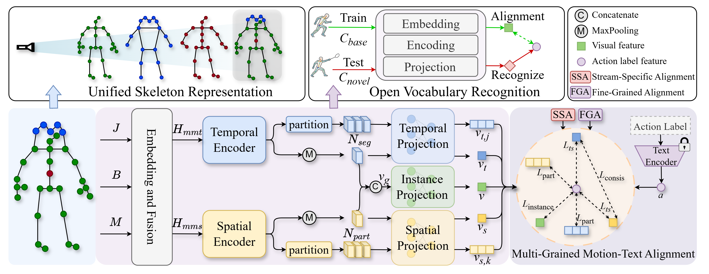

# Universal Skeleton Action Recognition

PyTorch implementation of **Toward Universal Skeleton-Based Action Recognition across Heterogeneous Skeletons and Open Vocabularies**.

This repository is a cleaned, GitHub-ready release of the main training pipeline used for universal skeleton-based action recognition under heterogeneous skeleton sources and open-vocabulary supervision.



## Overview

The released code focuses on the core setting described in the paper:

- heterogeneous training across `NTU RGB+D 120` 3D skeletons, `NTU RGB+D 120` 2D pose sequences, and `HumanML3D`
- a multi-stream spatio-temporal encoder
- multi-grained motion-text alignment
- long-tail multi-label evaluation on `HumanML3D`

## Highlights

- Minimal standalone research codebase instead of a full internal experiment dump
- Standard project layout with separated `datasets`, `models`, `utils`, and `scripts`
- Environment-variable-based dataset configuration for easier reproduction
- Small metadata files included, while large datasets and checkpoints stay external

## Repository Structure

```text
.
|-- assets/                   # figures and release assets
|-- data/
|   |-- annotations/          # label grouping metadata
|   `-- text/                 # label text maps
|-- datasets/                 # dataset loaders and preprocessing
|   `-- unified_skeleton.py   # 31-joint mapping and kinematic imputation
|-- models/                   # model definitions
|-- scripts/                  # runnable shell entrypoints
|-- third_party/clip/         # vendored CLIP implementation
|-- utils/                    # logging, paths, prompt helpers
|-- config.py                 # central experiment config
|-- train.py                  # main training entry
|-- requirements.txt
`-- README.md
```

## Installation

```bash
python -m venv .venv
source .venv/bin/activate
pip install -r requirements.txt
```

## Dataset Preparation

This repository does not bundle large datasets, pretrained checkpoints, or cached artifacts.  
The default codebase assumes that datasets are organized under the repository-local `data/` directory.

Recommended layout:

```text
data/
|-- cache/                                 # generated NTU-3D mmap cache
|-- annotations/
|   `-- humanml3d_label_groups.json        # included in this repo
|-- text/
|   |-- ntu120_label_map.txt               # included in this repo
|   `-- humanml3d400_label_map.txt         # included in this repo
|-- ntu/
|   `-- NTU120_CSub.npz                    # to be prepared by user
|-- nturgb/
|   |-- ntu120_hrnet.pkl                   # to be prepared by user
|   |-- ntu120_2d_Mean.npy                 # to be prepared by user
|   `-- ntu120_2d_Std.npy                  # to be prepared by user
`-- HumanML3D/
    |-- annotations_actions_400.json       # to be prepared by user
    |-- mean_std/
    |   |-- new_Mean.npy                   # to be prepared by user
    |   `-- new_Std.npy                    # to be prepared by user
    |-- new_joints/                        # to be prepared by user
    |-- texts/                             # to be prepared by user
    `-- split/
        |-- new_train_longtail.txt         # to be prepared by user
        `-- new_val_longtail.txt           # to be prepared by user
```

The default training code reads from the paths above. Environment variables are only optional overrides for special environments.
On first use, the NTU-3D NPZ members are extracted into `data/cache/ntu120_csub/`
and subsequently memory-mapped. Set `HOV_NTU_CACHE_DIR` to place this cache on a
different disk.

## Unified Skeleton Representation

All source formats are mapped to a fixed tensor with shape `(3, T, 31, 2)` before
being passed to the shared encoder. Kinect v2 joints occupy unified indices
`0-24`, COCO facial landmarks occupy `25-29`, and the SMPL upper-spine joint
occupies index `30`. The complete source-to-unified correspondence is defined in
`datasets/unified_skeleton.py`.

The implementation supports the four formats described in the paper:

| Source format | Native joints | Coordinates | Mapping key |
|---|---:|---:|---|
| Kinect v1 / NW-UCLA | 20 | 3D | `kinect_v1_20` |
| Kinect v2 / NTU | 25 | 3D | `kinect_v2_25` |
| COCO pose / NTU-2D | 17 | 2D | `coco17` |
| SMPL / HumanML3D | 22 | 3D | `smpl22` |

For 2D inputs, the depth channel is set to zero. Missing joints are then filled
with a deterministic, parameter-free program. Trunk joints are interpolated as
midpoints, while terminal joints use

```text
p_target = p_anchor + rho * (p_anchor - p_parent)
```

with `rho=0.25` for hands, `0.15` for feet, `0.18` for hand tips, and
`0.32` for thumbs. A 2D head is computed from the mean of its observed facial
landmarks; absent 3D facial landmarks use the head as a proxy. Rules run in a
fixed order, never overwrite observed joints, and execute only when all required
anchors are valid. Sequences with one observed person replicate that person into
the second member slot.

The validity masks used by this preprocessing step only control imputation. They
are not supplied to the encoder as reliability embeddings, gates, or attention
masks.

## Data Status

Already included in this repository:

- `data/annotations/humanml3d_label_groups.json`
- `data/text/ntu120_label_map.txt`
- `data/text/humanml3d400_label_map.txt`

Not uploaded to this repository yet:

- `data/ntu/NTU120_CSub.npz`
- `data/nturgb/ntu120_hrnet.pkl`
- `data/nturgb/ntu120_2d_Mean.npy`
- `data/nturgb/ntu120_2d_Std.npy`
- `data/HumanML3D/annotations_actions_400.json`
- `data/HumanML3D/mean_std/new_Mean.npy`
- `data/HumanML3D/mean_std/new_Std.npy`
- `data/HumanML3D/new_joints/`
- `data/HumanML3D/texts/`
- `data/HumanML3D/split/new_train_longtail.txt`
- `data/HumanML3D/split/new_val_longtail.txt`

These files are omitted from GitHub because of dataset size, preprocessing requirements, and redistribution constraints.

## Training

Run the main training script with:

```bash
bash scripts/train_main.sh
```

Or directly:

```bash
python train.py
```

Logs and checkpoints are written to `work_dirs/` by default.

Run the preprocessing and model contract tests with:

```bash
python -m unittest discover -s tests -v
```

## Reproducibility Notes

- The current release keeps the main experiment path only and removes many internal ablation variants.
- The released main configuration uses 31 unified joints, two person slots, four temporal segments, and four spatial body parts per person.
- The project vendors the CLIP implementation under `third_party/clip/`.
- Large datasets and generated artifacts are ignored by `.gitignore` so this folder can be used as a standalone GitHub repository.

## Release Notes

- `assets/` currently contains placeholders for figures and method illustrations.
- The repository metadata now points to the GitHub account `jidongkuang`.
- Update the final arXiv URL in `CITATION.cff` before publishing.

## Citation

See `CITATION.cff` for machine-readable citation metadata. Update the arXiv field before release.
